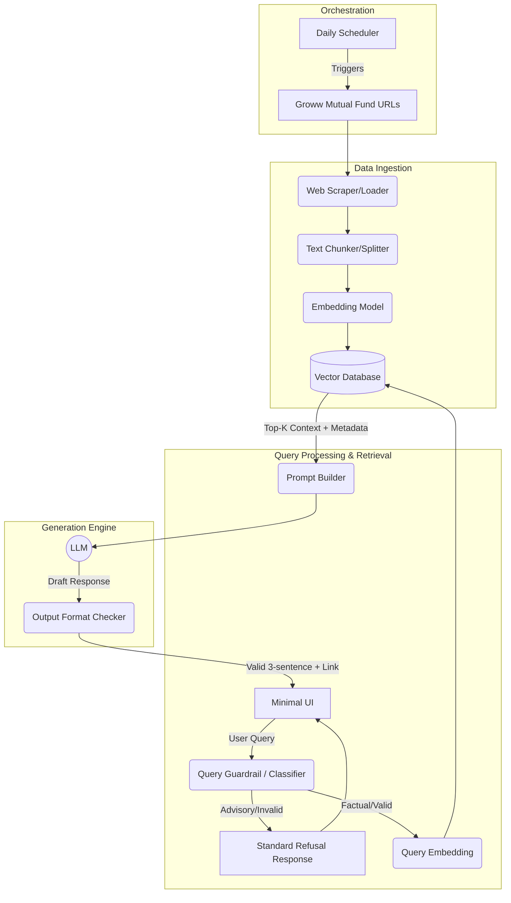

# Architecture Overview: Mutual Fund FAQ Assistant

This document outlines the architecture for the lightweight Retrieval-Augmented Generation (RAG) based Mutual Fund FAQ Assistant, designed to answer factual queries strictly using the predefined corpus.

## 1. High-Level Architecture

The system follows a standard RAG pattern enhanced with strict guardrails to meet the facts-only and compliance requirements. It consists of four main components:
1. **Data Ingestion Pipeline**
2. **Retrieval & Guardrail System**
3. **Generation Engine**
4. **User Interface**

## 2. Component Breakdown

### A. Data Ingestion Pipeline
Since the corpus is predefined to 5 specific Groww scheme URLs, the ingestion pipeline will be periodically triggered by a Daily Scheduler to keep NAVs and facts up to date. **Note: The system will exclusively ingest data from these 5 Groww URLs. No PDFs, official AMFI/SEBI factsheets, or any other external sources will be included in the corpus.**
- **Web Loader:** Extracts the raw HTML content from the 5 Groww URLs and converts it to clean text (removing headers/footers/navbars).
- **Text Splitter:** Splits the text into smaller, overlapping chunks (e.g., 500-1000 tokens) using a semantic or recursive character text splitter. This ensures that context like "Expense Ratio" remains tied to the specific "HDFC Scheme Name".
- **Metadata Tagging:** Each chunk is explicitly tagged with metadata: `source_url`, `scheme_name`, and `last_updated_date`.
- **Embedding Model:** Converts the chunks into dense vector representations using a BGE model (e.g., BAAI/bge-large-en).
- **Vector Database:** A lightweight vector store (e.g., ChromaDB, FAISS, or Pinecone) stores the embeddings for rapid semantic search.

### B. Query Processing & Retrieval
- **Query Guardrail:** Before any retrieval happens, the user query passes through an intent classifier (or a fast, small LLM prompt).
  - If the query asks for recommendations (e.g., "Should I invest?", "Which is better?"), the system immediately returns the predefined refusal template.
- **Query Embedding:** Valid queries are converted into vectors using the same Embedding Model used in ingestion.
- **Semantic Search:** The Vector DB returns the top-K most relevant chunks based on vector similarity.

### C. Generation Engine
The LLM (Groq) is provided with a strict system prompt and the retrieved chunks.
- **System Prompt Constraints:**
  - "You are a factual mutual fund assistant. You do not give financial advice."
  - "Answer ONLY using the provided context."
  - "Limit the response to a maximum of 3 sentences."
  - "Append the source link exactly once at the end of the text."
  - "Append the footer: 'Last updated from sources: <date>'."
- **Output Validation:** A lightweight programmatic check ensures the response does not exceed 3 sentences and contains exactly one URL before sending it to the user.

### D. User Interface (Minimal)
A simple frontend application (e.g., built with Streamlit, Gradio, or React).
- **Features:**
  - Clear header and welcome message.
  - 3 clickable example questions (e.g., "What is the exit load for HDFC Large Cap Fund?").
  - Persistent, visible disclaimer: **"Facts-only. No investment advice."**
  - A chat window displaying queries and formatted responses.

## 3. Security & Compliance
- **No PII Collection:** The UI will not request, nor will the backend store, any personal data (PAN, Aadhaar, phone numbers). The system is completely stateless.
- **Hallucination Prevention:** By keeping the temperature of the LLM at `0.0` and using strict RAG instructions ("If the answer is not in the context, say 'I do not have this information'"), hallucination is minimized.
- **Advice Restriction:** Addressed explicitly via the Query Guardrail. Performance comparisons and predictive queries will trigger the polite refusal and provide educational links (e.g., AMFI/SEBI).

## 4. Phase-wise Implementation Plan
This implementation plan details the phase-wise execution strategy for building the RAG-based Mutual Fund FAQ Assistant.

### Phase 1: Project Setup & Infrastructure
- Initialize the project repository and a Python virtual environment.
- Define the `requirements.txt` file including dependencies: `langchain`, `langchain-community`, `langchain-groq`, `sentence-transformers` (for BGE embeddings), `beautifulsoup4`, `chromadb`, `streamlit`, and `python-dotenv`.
- Setup `.env` for managing API keys securely.

### Phase 2: Data Ingestion Pipeline
- **Web Scraper:** Implement a script to fetch HTML exclusively from the 5 predefined Groww scheme URLs using `BeautifulSoup` or `WebBaseLoader`. (No PDFs or other external sources).
- **Text Cleaning:** Strip out headers, footers, and non-content elements to isolate the scheme facts.
- **Text Splitting:** Use `RecursiveCharacterTextSplitter` to chunk the text (e.g., 1000 tokens with 200 overlap), ensuring metadata (`source_url`, `scheme_name`) is attached to each chunk.
- **Vector Database:** Generate embeddings and store the chunks in a local instance of ChromaDB.

### Phase 3: Retrieval & Guardrail System
- **Query Guardrail:** Implement a lightweight classification step (either rule-based or a fast LLM prompt) that runs *before* retrieval. It will evaluate if the query is asking for investment advice or comparing performance.
  - If invalid, return the polite refusal template with an AMFI/SEBI educational link.
- **Semantic Retrieval:** For valid queries, convert the query to an embedding and retrieve the top-K chunks from ChromaDB.

### Phase 4: Generation Engine
- **Prompt Engineering:** Construct the strict system prompt that enforces:
  - Facts-only tone.
  - Maximum 3 sentences.
  - Exactly one citation link appended at the end.
  - Footer string: `"Last updated from sources: <date>"`.
- **LLM Integration:** Feed the retrieved chunks and the query into the LLM with `temperature=0.0` to minimize hallucination.
- **Output Validation:** Add a small programmatic check to truncate or format the LLM output to guarantee it does not exceed the 3-sentence constraint.

### Phase 5: User Interface (UI)
- **Streamlit App:** Develop a lightweight `app.py` frontend.
- **Layout:** Include a welcome message, a clear chat interface, and a persistent disclaimer at the top or bottom: `“Facts-only. No investment advice.”`
- **Example Queries:** Provide 3 clickable buttons for example questions to guide user interaction.

### Phase 6: Scheduler Component
- **Cron/Scheduler:** Implement a scheduling mechanism to run the ingestion script automatically every day.
- **Data Refresh:** Ensure the script seamlessly updates the vector database so the assistant has the latest NAV and fund metrics.

### Phase 7: Testing & Validation
- **Accuracy Testing:** Test factual queries specific to the 5 ingested schemes (e.g., expense ratios, lock-in periods).
- **Refusal Testing:** Test adversarial queries ("Should I buy HDFC Mid Cap?", "Is this fund good?") to ensure the guardrail blocks them reliably.
- **Constraint Testing:** Ensure responses are always ≤ 3 sentences and contain exactly one link.
